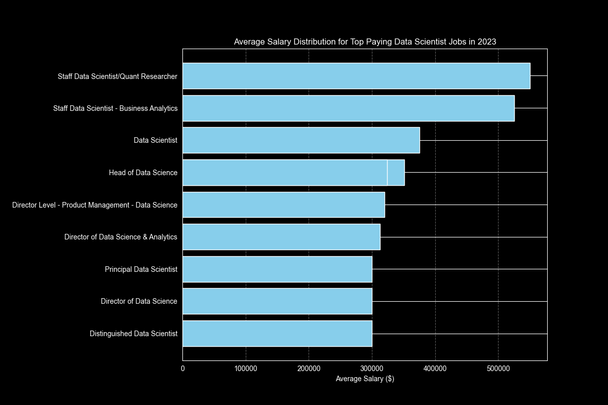
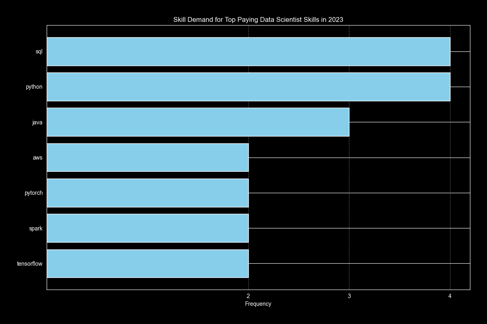

# Introduction
The purpose of this project is to look at the data job market. The focus is on positions for Data Scientists: the intention is to get insights about top-paying jobs and the most important skills to have and to improve.

SQL queries: check them out at [project_sql folder](/project_sql/).

# Background
This project comes from my desire to investigate the data job market effectively while at the same time improving my SQL skills. 

The dataset is provided by [Luke Barousse](https://lukebarousse.com/sql) and contains info about jobs, salaries, skills and companies coming from job postings of 2023.

# Tools I used
The following tool have been used to carry out this analysis:
- **SQL** to query the database.
- **PostgreSQL** as database management system.
- **Visual Studio Code** to manage the database and execute the queries.
- **Git & GitHub** for controllin versions and sharing my SQL scripts and analysis.
- **Python/Matplotlib** for creating charts.

# The Analysis
This project is all about exploring the job market in order to understand what is worth learning to get the most out of a career in Data Science. 

One of my priorities is to have the possibility to work from anywhere. Given this, I want to look for those skills that allow me to have access to a large number of jobs (just to be secure in the future) and those skills that grant me the access to top-paying jobs.


### 1. Top Paying Data Scientist Jobs
To identify the highest paying roles for Data Scientists, first I looked only for the ones offering the possibility of working from anywhere, and then sorted them on salary base.

```sql
SELECT
    job_id,
    job_title,
    job_location,
    job_schedule_type,
    salary_year_avg,
    job_posted_date,
    company_dim.name AS company_name
FROM
    job_postings_fact
LEFT JOIN company_dim ON job_postings_fact.company_id = company_dim.company_id
WHERE
    job_title_short = 'Data Scientist' AND
    job_location = 'Anywhere' AND
    salary_year_avg IS NOT NULL
ORDER BY
    salary_year_avg DESC
LIMIT 10;
```
Quick Insights into Top Paying Data Scientist Job Postings in 2023

**1. Extremely High Salaries for Senior Roles**

Staff Data Scientist/Quant Researcher and Business Analytics: Positions at Selby Jennings offer exceptionally high salaries ($550,000 and $525,000), indicating that specialized and senior-level roles command top-tier pay in the data science field.

**2. Leadership Positions are Highly Valued**

Head of Data Science: Roles at Demandbase offer $351,500 and $324,000, while Director-level roles at companies like Teramind and Reddit ($320,000 and $313,000) also show substantial compensation, reflecting the premium placed on leadership and strategic direction in data science.

**3. Diverse Industry Demand**

Companies Across Various Sectors: High-paying jobs are available in different sectors, from financial services (Selby Jennings, Algo Capital Group) to retail (Walmart) and technology (Storm5, Storm4), showcasing the widespread demand for data science expertise across industries.


*Bar chart showing the top 10 Data Scientist jobs ordered by salary.*

### 2. Skills for Top Paying Jobs
Having the top paying Data Scientist jobs, it would be interesting to understand which skills are required for them, which is why I have joined the job postings data with the skills data.


```sql
WITH top_paying_jobs AS (
SELECT
    job_id,
    job_title,
    salary_year_avg,
    company_dim.name AS company_name
FROM
    job_postings_fact
LEFT JOIN company_dim ON job_postings_fact.company_id = company_dim.company_id
WHERE
    job_title_short = 'Data Scientist' AND
    job_location = 'Anywhere' AND
    salary_year_avg IS NOT NULL
ORDER BY
    salary_year_avg DESC
LIMIT 10
), skills_top_job AS (
    SELECT 
        top_paying_jobs.*,
        skills
    FROM top_paying_jobs
    INNER JOIN skills_job_dim ON top_paying_jobs.job_id = skills_job_dim.job_id
    INNER JOIN skills_dim ON skills_job_dim.skill_id = skills_dim.skill_id
    ORDER BY
        salary_year_avg DESC)

SELECT 
    skills,
    COUNT(*) AS skill_demand,
    ROUND(AVG(salary_year_avg),0) AS average_salary
FROM skills_top_job
GROUP BY
    skills
ORDER BY
    skill_demand DESC;
```

This allows to state that **Python** and **SQL** are very important (as expected), and moreover, it seams that the knwoledge of **Deep Learning** libraries is also requested.


*Bar chart showing the count of skills appearing in the top 10 paying jobs.*

### 3. Top Demanded Skills for Data Scientists

```sql
SELECT 
    skills,
    COUNT(skills_job_dim.job_id) AS demand_count
FROM 
    job_postings_fact
INNER JOIN skills_job_dim ON job_postings_fact.job_id = skills_job_dim.job_id
INNER JOIN skills_dim ON skills_job_dim.skill_id = skills_dim.skill_id
WHERE
    job_title_short = 'Data Scientist'
GROUP BY 
    skills
ORDER BY
    demand_count DESC
LIMIT 5;
```
| Skills   | Demand Count |
|----------|--------------|
| Python   | 114016       |
| SQL      | 79174        |
| R        | 59754        |
| SAS      | 29642        |
| Tableau  | 29513        |

### 4. Top Paying Skills

```sql
SELECT 
    skills,
    ROUND(AVG(salary_year_avg), 0) AS avg_salary
FROM 
    job_postings_fact
INNER JOIN skills_job_dim ON job_postings_fact.job_id = skills_job_dim.job_id
INNER JOIN skills_dim ON skills_job_dim.skill_id = skills_dim.skill_id
WHERE
    job_title_short = 'Data Scientist' AND
    salary_year_avg IS NOT NULL AND
    job_work_from_home = TRUE
GROUP BY 
    skills
ORDER BY
    avg_salary DESC
LIMIT 25;
```

| Skills       | Avg Salary ($) |
|--------------|------------|
| GDPR         | 217738     |
| Golang       | 208750     |
| Atlassian    | 189700     |
| Selenium     | 180000     |
| OpenCV       | 172500     |
| Neo4j        | 171655     |
| MicroStrategy| 171147     |
| DynamoDB     | 169670     |
| PHP          | 168125     |
| Tidyverse    | 165513     |

### 5. Optimal Skills to Learn

```sql
WITH skills_demand AS (
    SELECT
        skills_dim.skill_id,
        skills_dim.skills,
        COUNT(skills_job_dim.job_id) AS demand_count
    FROM job_postings_fact
    INNER JOIN skills_job_dim ON job_postings_fact.job_id = skills_job_dim.job_id
    INNER JOIN skills_dim ON skills_job_dim.skill_id = skills_dim.skill_id
    WHERE
        job_title_short = 'Data Scientist'
        AND salary_year_avg IS NOT NULL
        AND job_work_from_home = TRUE
    GROUP BY
        skills_dim.skill_id
), average_salary AS(
    SELECT
        skills_job_dim.skill_id,
        ROUND(AVG(job_postings_fact.salary_year_avg), 0) AS avg_salary
    FROM job_postings_fact
    INNER JOIN skills_job_dim ON job_postings_fact.job_id = skills_job_dim.job_id
    INNER JOIN skills_dim ON skills_job_dim.skill_id = skills_dim.skill_id
    WHERE
        job_title_short = 'Data Scientist'
        AND salary_year_avg IS NOT NULL
        AND job_work_from_home = TRUE
    GROUP BY
        skills_job_dim.skill_id
)

SELECT
    skills_demand.skill_id,
    skills_demand.skills,
    demand_count,
    avg_salary
FROM
    skills_demand
INNER JOIN average_salary ON skills_demand.skill_id = average_salary.skill_id
WHERE
    demand_count > 10
ORDER BY
    avg_salary DESC,
    demand_count DESC
LIMIT 25
```

| Skills      | Demand Count | Avg Salary ($) |
|-------------|--------------|------------|
| C           | 48           | 164865     |
| Go          | 57           | 164691     |
| Qlik        | 15           | 164485     |
| Looker      | 57           | 158715     |
| Airflow     | 23           | 157414     |
| BigQuery    | 36           | 157142     |
| Scala       | 56           | 156702     |
| GCP         | 59           | 155811     |
| Snowflake   | 72           | 152687     |
| PyTorch     | 115          | 152603     |


# What I learned
# Conclusions
